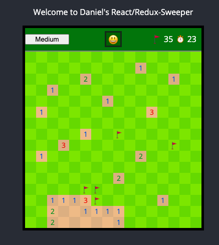

# Welcome to React Minesweeper

This project was bootstrapped with [Create React App](https://github.com/facebook/create-react-app), and utilizes: 
1. [Redux](https://redux.js.org/) for state management.
2. [Jest](https://jestjs.io/) for function unit tests.
3. [Storybook](https://storybook.js.org/) for component unit tests.



## Getting Started:

Clone the repo to a local folder of your choice.

From the root directory, run  
```
npm install
```

From the project directory, you can run:

#### `npm start`

Runs the app in the development mode.<br />
Open [http://localhost:3000](http://localhost:3000) to view it in the browser.

#### `npm test`

Launches the jest test runner in the interactive watch mode.

#### `npm run storybook`

Builds and launches the storybook component test environment at [http://localhost:6006](http://localhost:6006) <br /> 
Here you can see component renderings. 

## Future Features:

Currently this minesweeper version only has one difficulty setting. The game generation is agnostic to the size of the board generated, and a small refactor would allow dynamic board size.

Testing focused on redux is missing, and implementing some store tests would aid the project as a whole.